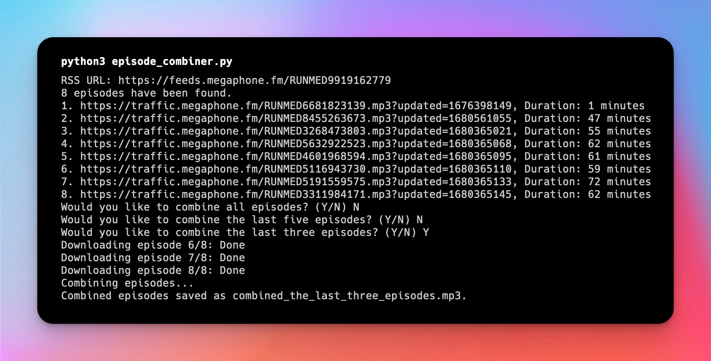

# Podcast Episode Combiner

This Python script is designed to download and combine podcast episodes from a specified RSS feed into a single MP3 file. 



## Prerequisites

- Python installed on your system.
- `ffmpeg` must be installed and accessible in your system's PATH. This is crucial for the script to combine audio files.
- `curl` should be installed on your system as it's used for downloading episodes.

## Quick Start

1. **Clone the Repository or Download the Script**: Get the script onto your local machine.
2. **Install Required Python Packages**: Ensure `requests` is installed. You can install it using pip: ```pip install requests```
3. **Find Your Podcast's RSS Feed**: Visit [listennotes.com](https://www.listennotes.com), search for your podcast and copy the url of the RSS feed.

4. **Run the Script**: ```python3 episode_combiner.py```

5. **Follow On-screen Prompts**: You'll be asked for the RSS url, and which episodes you'd like to combine; all, the most recent five, or the most recent three.

6. **Output**: The final combined mp3 will be saved in the same directory as the script. Some podcast apps, like [Pocket Casts](https://pocketcasts.com), grant the ability to [upload an mp3 as a new file](https://support.pocketcasts.com/knowledge-base/adding-files-ios/), and the app will remember your progress through the file, just like an audiobook (or podcast).

## Notes

*Why?* In creating [DefunktCast](https://defunkt-cast.herokuapp.com/), I wondered why there are so few workable solutions for listening to older podcasts. Podcasts are great while they're being published and the feed's getting refreshed, but they require a lot of manual manipulation once a show is complete. 

This script is a simple solution for surfacing older (or dead!) podcasts. It may not work as expected with non-podcast RSS feeds, with podcasts exclusive to Spotify, or with files that are not in MP3 format.